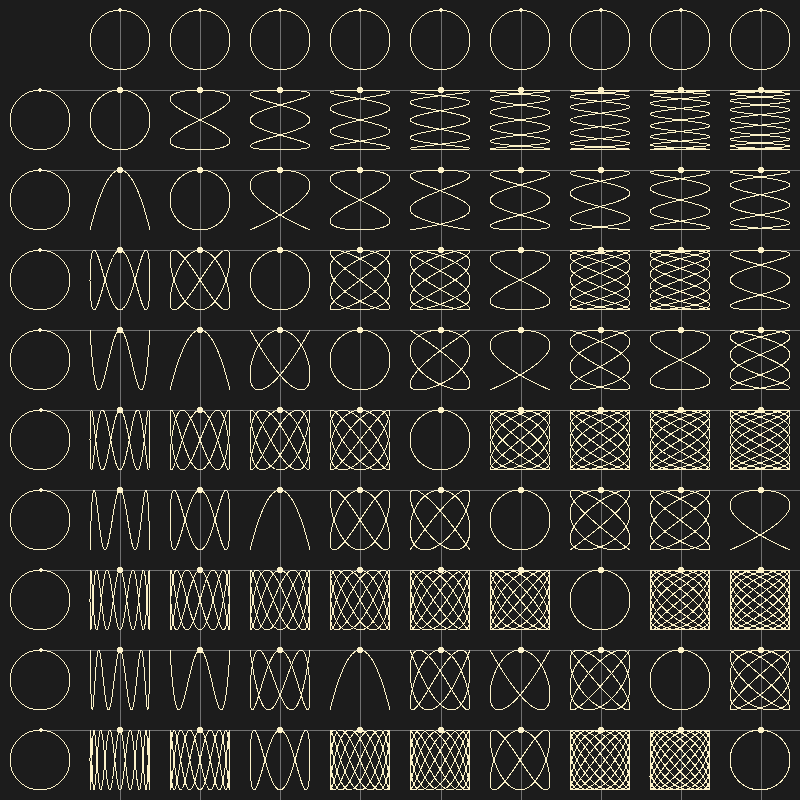

# Lissajous Curve Table Renderer

This program renders Lissajous Curves using the Raylib library. It is written
in C and can be compiled with `cc` or `gcc` without needing any additional
dependencies.

 

## Requirements

- `cc` or `gcc` compiler
- Raylib library (included in the source code for simplicity)

## Compilation

To compile the program, simply run the provided `build.sh` script:

```sh ./build.sh ```

## Running the Program

Once compiled, you can run the program with:

```sh ./lissajous ```

## Features

- Renders Lissajous Curves using the Raylib library.
- Simple and easy-to-use graphical rendering.

## License

This project is licensed under the MIT License. See the [LICENSE](LICENSE) file
for details.

## Acknowledgements

- [Raylib](https://www.raylib.com/) - Simple and easy-to-use library to enjoy
videogames programming.

You can now copy the text directly from this response and paste it into your
`README.md` file.
